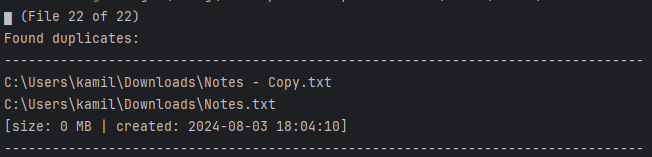

# Find Duplicates By Hash

simple utility that finds duplicates based on HASH of the file 
and displays it together with size, date created and date modified

## Usage

```text
<application> STRING
```
_STRING_ is the path to the root folder

## Screenshot
